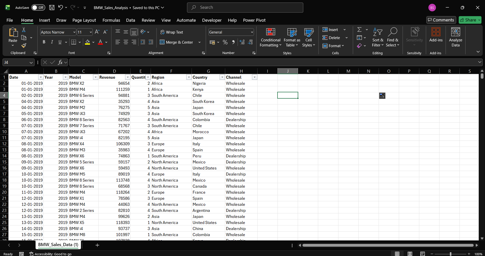

# 🚘 BMW Sales Dashboard

This project showcases an interactive **Power BI dashboard** analyzing BMW's sales performance across models, regions, and sales channels.  
It provides insights into revenue trends, top-performing models, and regional sales distribution.

---

## 📊 **Dataset Overview**
The dataset contains the following key columns:
- **Date / Year:** Time dimension for sales trend analysis  
- **Model:** Different BMW car models  
- **Revenue:** Total income generated per model  
- **Quantity:** Units sold  
- **Region / Country:** Geographical distribution of sales  
- **Channel:** Sales medium (e.g., Dealer, Online, Wholesale)

📸 **Dataset Preview:**  

---

## 🧠 **Project Insights**
- Identify **top-performing BMW models** by revenue and quantity  
- Compare **regional sales** to find best-performing markets  
- Analyze **channel-wise performance** to optimize sales strategy  
- Explore **yearly trends** in sales growth

---

## 🧩 **Files Included**
| File Name | Description |
|------------|-------------|
| `Dataset_Snapshot_BMW.png` | Image preview of the dataset |
| `BMW_Sales_Dataset.xlsx` | Raw dataset used for analysis |
| `BMW_Dashboard.pbix` | Power BI dashboard file |

---

## ⚙️ **Tools & Technologies**
- **Power BI** — Dashboard creation and visualization  
- **Microsoft Excel** — Data cleaning and preparation  
- **GitHub** — Project hosting and version control

---

## 🪄 **How to Use**
1. Download the Power BI file (`BMW_Dashboard.pbix`)  
2. Open it in Power BI Desktop  
3. Explore interactive visuals and filters  
4. Modify or extend the dataset as needed

---

## 📁 **Project Purpose**
This project was created as part of a Data Visualization learning portfolio, with the goal of demonstrating how raw business data can be transformed into meaningful insights through clear and interactive storytelling. By focusing on BMW’s sales performance across models, regions, and channels, the dashboard highlights the practical application of Power BI and Excel in solving real-world business problems.

The purpose goes beyond simply reporting numbers—it emphasizes the importance of data-driven decision making. Through visual exploration, users can identify top-performing models, compare regional markets, and evaluate the effectiveness of different sales channels. These insights can help businesses optimize their strategies, improve customer engagement, and forecast future growth.

## 🏷️ **Tags**
`PowerBI` • `Data Analysis` • `Dashboard` • `BMW` • `Sales Analytics` • `Business Intelligence`

---

## 📜 **License**
This project is shared under the **MIT License** — feel free to use and modify it for learning purposes.
